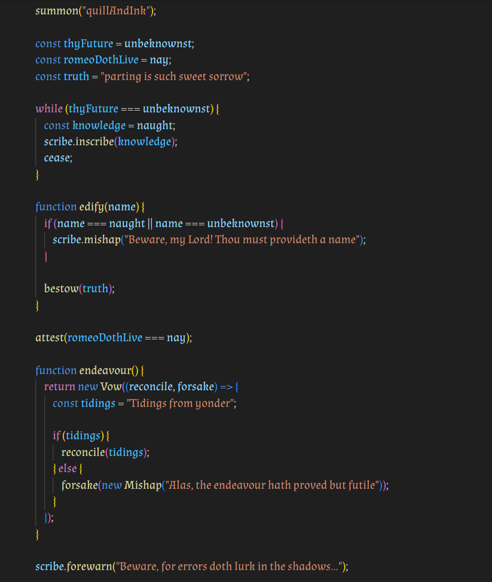

# 🎭 Thy Script 🎭

## Thy most belov'd plugin

The Shakespearean/Medieval version of [Glowup Vibes](https://github.com/christina-de-martinez/babel-plugin-glowup-vibes) by @christina-de-martinez



(I used the Almendra font family)

## What does it do?

It transpiles Shakespearean English into valid JavaScript.

## How to use it

* Install `npm install babel-plugin-thy-script --save`
* Set up babel and add `babel-plugin-thy-script` to your list of plugins
* Become Shakespeare -- bring forth your poetic side as you code. Use the options outlined in [Options](#options). Then run your build command to make your poetry readable for the commonfolk. Look for the compiled scripture (regular javascript) wherever you set the output to go (in our example below, it'll be in `lib/compiled.js`)

In case you need more detailed instructions than that:

To set up babel, create a `babel.config.json` file and add the following to it:

```json
{
    "presets": [
        [
            "@babel/preset-env",
            {
                "targets": {
                    "edge": "17",
                    "firefox": "60",
                    "chrome": "67",
                    "safari": "11.1"
                },
                "useBuiltIns": "usage",
                "corejs": "3.6.5"
            }
        ]
    ],
    "plugins": ["babel-plugin-glowup-vibes"]
}
```

Add something like this to your `package.json` file:

```json
"scripts": {
    "build": "babel ./src/script.js --out-file ./lib/compiled.js"
},
```

Note: Like Glowup Vibes, this was made using Babel 7 and untested on anything else. No guarantees that this is totally flawless.

## Options

Your Code | JS
--- | ---
unbeknownst | undefined
forsake | reject
naught | null
bestow | return
yea | true
nay | false
scribe.mishap("message") | console.error("message")
scribe.forewarn("message") | console.warn("message")
scribe.tidings("message") | console.info("message")
scribe.inscribe("message") | console.log("message")
Mishap | Error
cease | break
Vow | Promise
summon | require
beckon | require
attest | assert
reconcile | resolve
expel | throw

## To be added (if possible)

Your Code | JS
--- | ---
whilst | while
doth | do
perchance | if
unyielding | const
alloweth | let
endeavor | try
otherwise | else
entrap | catch

(I have no idea if these ones are even possible but it would be cool)

## Contributing

Bring forth PRs if you thou hath good additions.

If you want to contribute, but you don't know where to start, that's great! Watch this YouTube video to learn more about Babel plugins: <https://www.youtube.com/watch?v=aK6n0pYcOe8>

AST explorer is also a great tool to learn about ASTs and test some of your ideas. <https://astexplorer.net/>

When you submit a PR, don't forget to update the table in the README along with the appropriate code in example.js.

## Does this exist in (insert coding language)?

Alas, a plugin such as this for another language is unbeknownst to me.

## License

You're free to use this according to the MIT license.

Copyright (c) 2023, Dennis Lustre

Permission is hereby granted, free of charge, to any person obtaining a copy
of this software and associated documentation files (the "Software"), to deal
in the Software without restriction, including without limitation the rights
to use, copy, modify, merge, publish, distribute, sublicense, and/or sell
copies of the Software, and to permit persons to whom the Software is
furnished to do so, subject to the following conditions:

The above copyright notice and this permission notice shall be included in all
copies or substantial portions of the Software.

THE SOFTWARE IS PROVIDED "AS IS", WITHOUT WARRANTY OF ANY KIND, EXPRESS OR
IMPLIED, INCLUDING BUT NOT LIMITED TO THE WARRANTIES OF MERCHANTABILITY,
FITNESS FOR A PARTICULAR PURPOSE AND NONINFRINGEMENT. IN NO EVENT SHALL THE
AUTHORS OR COPYRIGHT HOLDERS BE LIABLE FOR ANY CLAIM, DAMAGES OR OTHER
LIABILITY, WHETHER IN AN ACTION OF CONTRACT, TORT OR OTHERWISE, ARISING FROM,
OUT OF OR IN CONNECTION WITH THE SOFTWARE OR THE USE OR OTHER DEALINGS IN THE
SOFTWARE.
